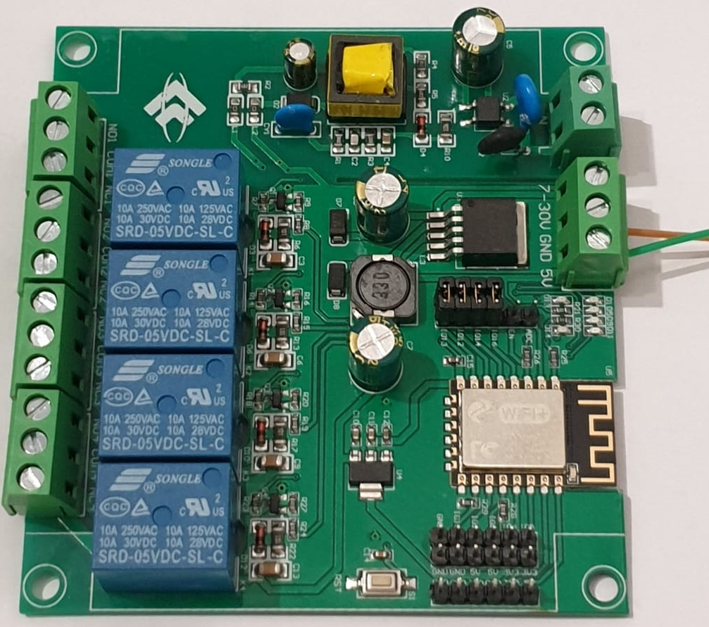

# aeg_hob2hood

# What is Hob2Hood
The Hob2Hood function automatically controls the power of the extraction based upon the hob usage. The hood will turn on at the most suitable speed, adapting the extraction capacity to the cooking level used in the cooking zone.

# What is this project
Just lean back and comfortably control your extractor hood via MQTT or let your hob control it.

# Compatibility
This program is compatible with ESP8266 (Wemos or NodeMCU und 4 Relays modul)

#### How to connect an NRF24 to an ESP8266.
NodeMCU | IR | Relays
-- | -- | --
GND | GND | GND
3V3 | VCC | VCC
D2 (GPIO4) | Signal | -
D8 (GPIO15) | - | IN1
D5 (GPIO14) | - | IN2
D7 (GPIO13) | - | IN3
D6 (GPIO12) | - | IN4

#### or use one pcb with 4 Relays.

